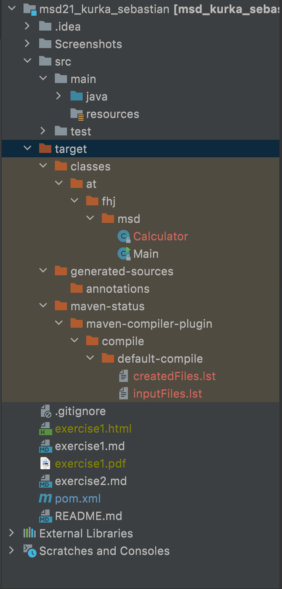
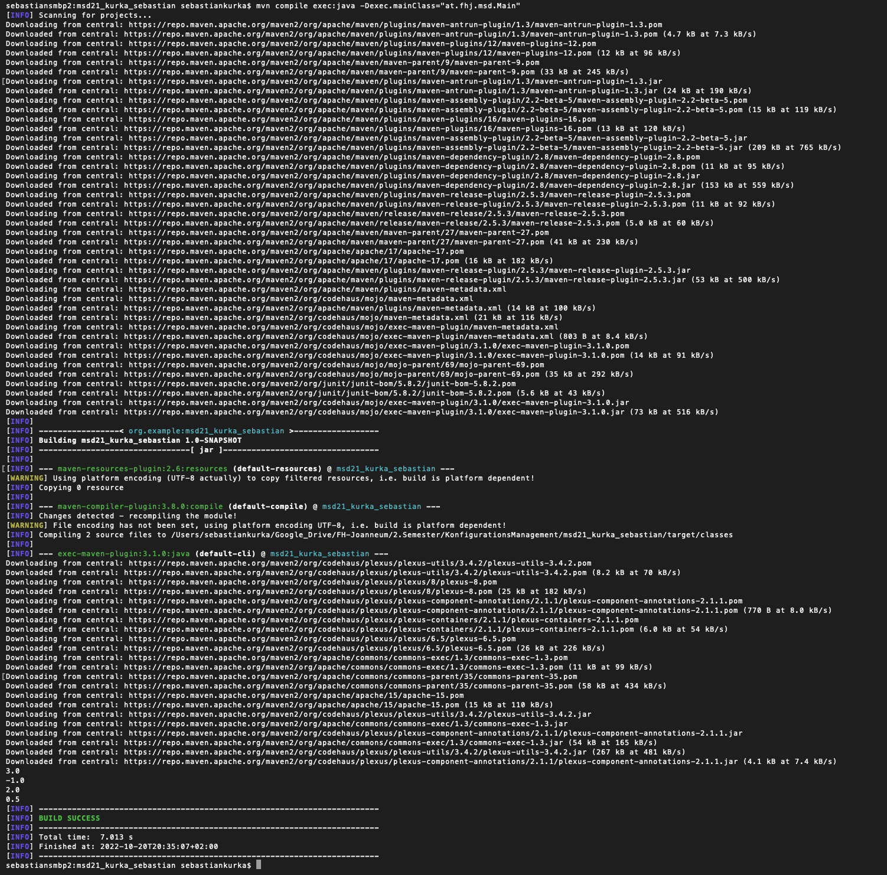

# Exercise 3

1. Klasse Calculator erstellt.

2. im src/main/java den Ordner at.fhj.msd erstellt.

3. Die Datei Calculator.java in den Ordner verschoben und das Package deklariert.

4. in Calculator.java die Methoden erstellt.

5. Die Main-Klasse im selben Package hinzugefügt. Die Methoden der Calculator Klasse aufgerufen.

6. Das Programm mit ```mvn compile exec:java -Dexec.mainClass="at.fhj.msd.Main"``` kompiliert und ausgeführt.
   Der Pfad zur auszuführenden Klasse wird als Parameter übergeben.

7. Nach dem ersten Kompilieren der Datei mithilfe von Maven wurde ein "Target" ordner erstellt indem sich die
   kompeilten klassen befinden. 
   

8. Den gegebenen Block in die pom.xml Datei eingefügt.

